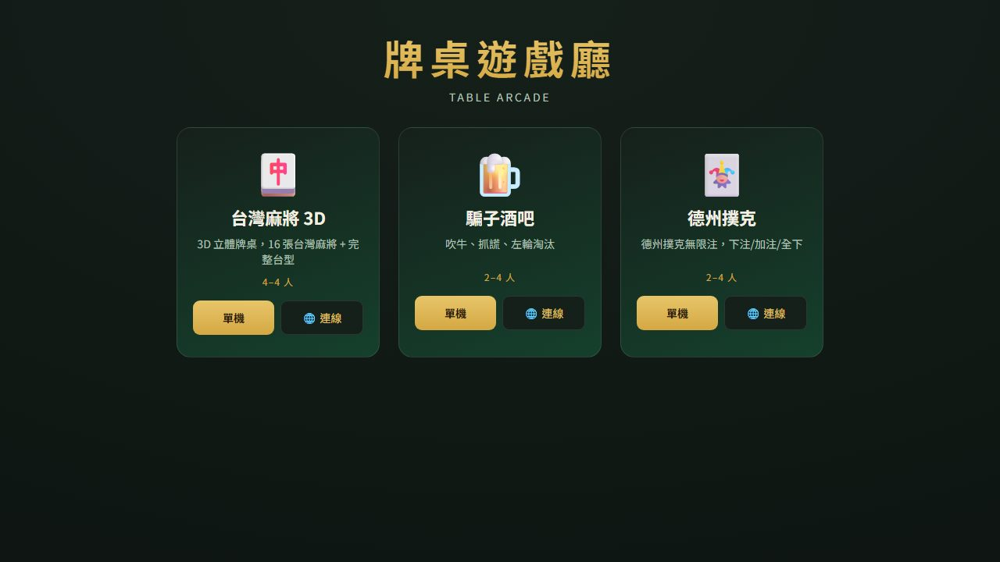
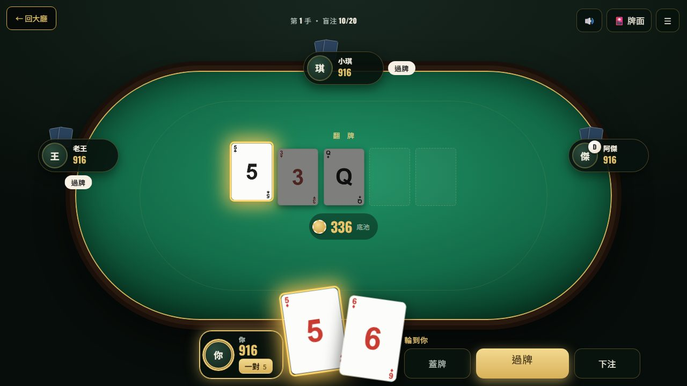
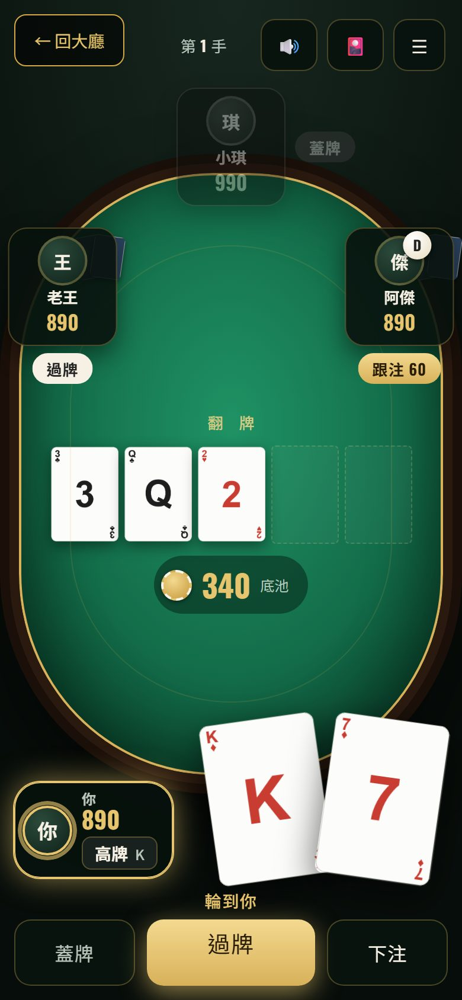
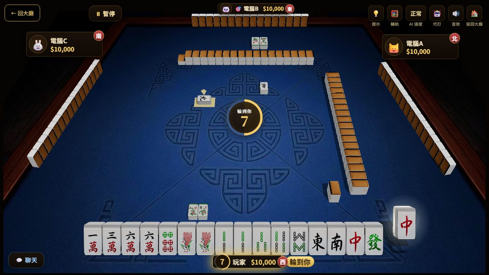
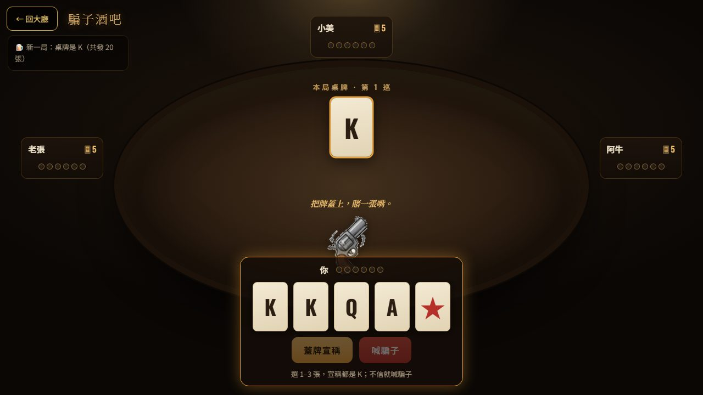
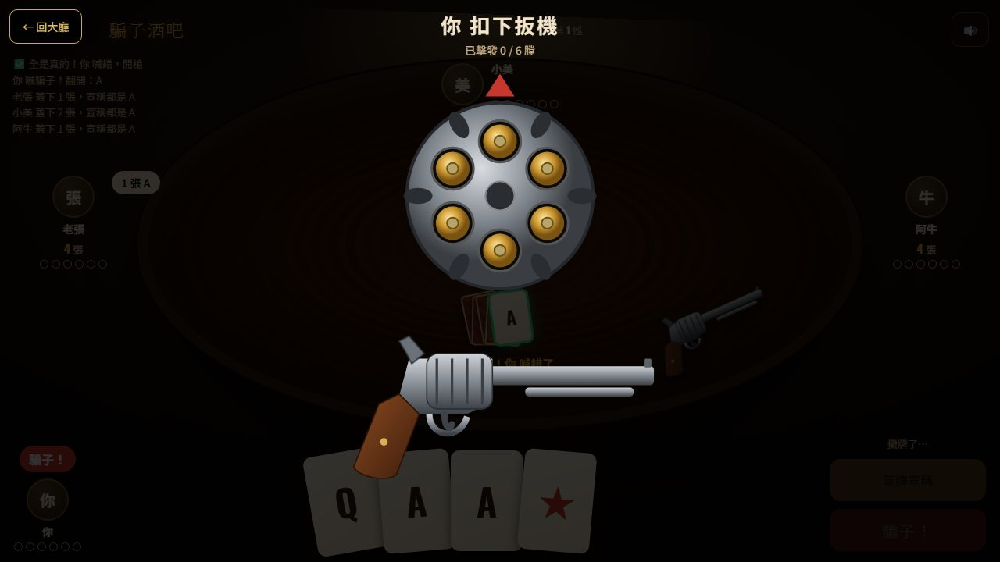

# 牌桌遊戲廳 — Table Arcade

> 純前端、零建置的桌遊平台。一個大廳，三款牌桌遊戲；單機對電腦，或開房間邀朋友連線。

🔗 **線上遊玩**：https://game-arcade-7rz.pages.dev/



## 遊戲

| 遊戲 | 玩法 | 單機 | 連線 |
|------|------|:---:|:---:|
| 🀄 台灣麻將 3D | 16 張台灣麻將、完整台型計算，3D 立體牌桌 | ✅ 3 位電腦 | ✅ 最多 4 人 |
| 🍺 騙子酒吧 | 蓋牌宣稱、喊騙子、左輪輪盤淘汰 | ✅ | ✅ 2–4 人 |
| 🃏 德州撲克 | 無限注德州撲克：過牌／跟注／加注／全下，含邊池 | ✅ | ✅ 2–4 人 |

連線的空位都可以由電腦補上。

### 🃏 德州撲克



- **第一人稱手牌**：自己的兩張牌放大在畫面下方，按住可以掀起來看。
- **牌型提示**：即時顯示目前牌型（例如「一對 5」「葫蘆 8 帶 3」）。組成牌型的牌加金框發光，其餘公共牌變暗。
- **動畫**：洗牌、發牌（先收牌背，到齊再翻面）、下注籌碼飛向桌面、換街收進底池、公共牌逐張落桌、攤牌亮牌、底池飛向贏家。
- **加注**：按「加注」開啟金額面板，有最小／½ 底池／底池／全下四個預設，也能用滑桿或 ± 微調，按「確認」才送出。
- **音效**：籌碼與撲克牌為實錄音效，右上角可關閉。
- **牌面風格**：6 種牌組即時切換（經典標準、星辰夜空、山水雅韻、復古 Art Deco、簡約、極簡），會自動記住。
- **規則**：最小加注依上一次加注的增量計算；不足額的全下不會重開加注權；含邊池分配與平分時的零頭處理。



### 🀄 台灣麻將 3D



- 3D 立體牌桌，開局有砌牌、擲骰、開門的儀式動畫。
- 吃／碰／槓／胡的提示與動畫，聽牌時直接在手牌上標示。
- 預錄語音報牌，連線房間內可以用快捷喊話聊天。
- 可調底台、每台金額、起始籌碼、出牌限時、東風局或南風局。
- 牌桌為橫向設計，手機請橫拿遊玩。

### 🍺 騙子酒吧



- **西部酒館牌桌**：俯視圓木桌、搖晃的吊燈，手牌以第一人稱展開，點選 1–3 張後按「蓋 N 張，宣稱是 X」。
- **喊騙子**：拍桌聲加上「騙子！」印章，上一手的牌逐張翻開，真牌亮綠框、假牌亮紅框。
- **俄羅斯輪盤**：輸的人進入全螢幕演出：彈巢轉動、扳起擊錘，最後才揭曉「喀」或「砰」。
- **音效**：酒吧環境人聲、碰杯、拍桌、真實左輪槍聲與擊錘聲，皆為實錄素材。



- 牌庫 20 張：K、Q、A 各 6 張，加上 2 張萬用的鬼牌。每局指定一種桌牌。
- 輪到你時，蓋 1–3 張牌並宣稱「都是桌牌」，或者喊上家「騙子」翻牌檢查。
- 被抓到說謊，或抓錯人的一方，要對自己開一槍左輪（6 膛 1 發）；中彈淘汰，最後活下來的人獲勝。

## 連線怎麼玩

1. 在大廳點遊戲卡片上的「🌐 連線」，建立房間。
2. 把邀請連結傳給朋友，對方打開連結就會進到同一個房間。
3. 人數不足時用電腦補位，房主按開始。

採用「房主權威」的點對點連線：房主的瀏覽器負責判定規則與發牌，其他玩家只會收到自己能看的資訊，例如看不到別人的手牌。房主關閉頁面，房間就會結束。

## 支援裝置

- 針對桌機瀏覽器（Chrome、Edge、Firefox、Safari）與手機瀏覽器（iPhone Safari、Android Chrome）設計。
- 德州撲克與騙子酒吧支援直向與橫向；麻將請橫拿。
- 觸控按鈕至少 44px。系統開啟「減少動態效果」時，動畫會自動關閉。
- iPhone 開啟靜音鍵時，網頁音效會被系統靜音。

## 技術

- 原生 HTML／CSS／JavaScript，沒有框架，也沒有打包步驟。
- 外部資源只走 CDN：PeerJS（連線）、three.js（麻將 3D）、Google Fonts。
- 共用核心在 `core/`：平台外殼、音效、主題、UI、牌面、連線層。每款遊戲放在 `games/<id>/`，透過 `Platform.register()` 掛進大廳。

```
index.html          大廳
core/               共用核心（platform / ui / theme / audio / cards / net）
games/mahjong/      台灣麻將 3D
games/liarsbar/     騙子酒吧
games/texas/        德州撲克（含 audio/ 音效）
assets/             共用素材（牌面 sprite 等）
docs/screenshots/   README 截圖
```

## 本機預覽

需要透過本機伺服器開啟，直接雙擊 `index.html` 會因瀏覽器限制而讀不到音效等檔案。

```bash
python -m http.server 8080
```

然後開啟 http://localhost:8080/

## 部署

主要發佈在 Cloudflare Pages（https://game-arcade-7rz.pages.dev/）：專案連結本 repo 的 `main` 分支，Framework preset 選 None、Build command 與輸出目錄留空，推送到 `main` 後約一分鐘自動部署。

GitHub Pages 同時保留為備援（Settings → Pages → Deploy from a branch → `main` / `(root)`）。專案根目錄附有 `.nojekyll`，確保所有檔案原樣提供。

## 素材與授權

- 德州撲克的籌碼與撲克牌音效：[Kenney — Casino Audio](https://kenney.nl/assets/casino-audio)，CC0 授權（授權檔見 `core/sfx/LICENSE-kenney.txt`，各遊戲共用）。
- 騙子酒吧的音效：[BigSoundBank](https://bigsoundbank.com)（酒吧環境音、擊錘、碰杯）、[The Free Firearm Sound Library](https://opengameart.org/content/the-free-firearm-sound-library)（左輪槍聲）、[Kenney](https://kenney.nl)（拍桌、玻璃、撲克牌），皆為 CC0 授權，逐檔來源見 `games/liarsbar/audio/CREDITS.txt`。
- 麻將牌、撲克牌面、牌背等圖像素材為自製或衍生作品。
- 程式碼為個人作品。
